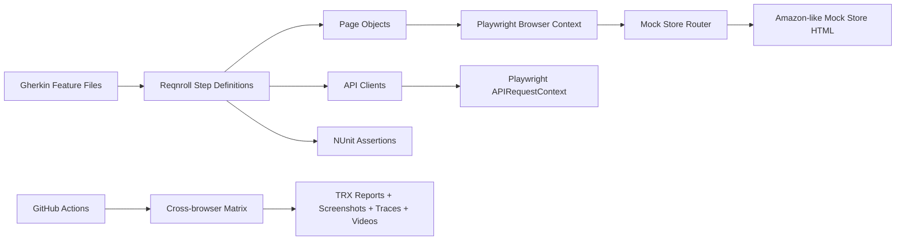
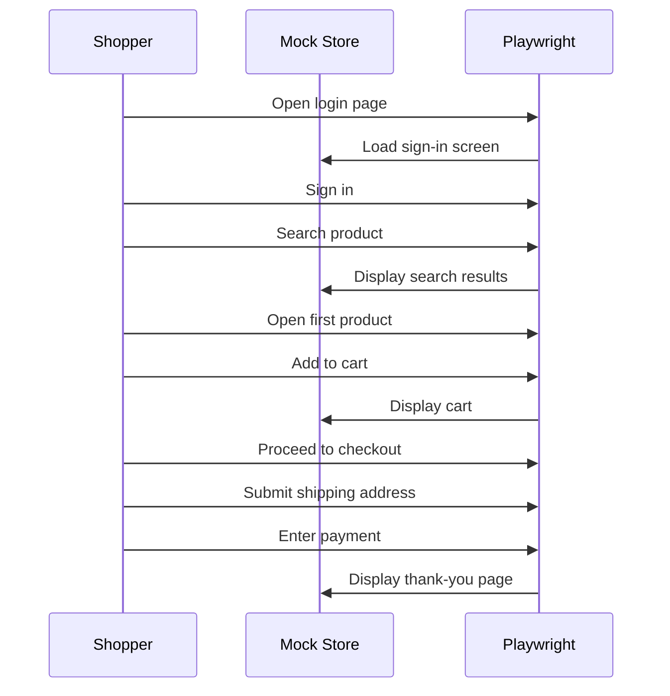

# C# Playwright Automation Framework Report

## Executive Summary

This repository contains a scalable C# automation framework for validating an Amazon-like shopping experience using Playwright, NUnit, and Reqnroll BDD. The framework tests UI journeys, API contracts, cross-browser behavior, and CI/CD execution through GitHub Actions.

The app under test is a controlled mock store served through Playwright request routing at `https://mock-store.local`. This gives the framework a realistic retail workflow without relying on public Amazon pages, which commonly block automated traffic.

## Tech Stack

| Area | Technology | Purpose |
| --- | --- | --- |
| Language | C# | Strongly typed automation code |
| Runtime | .NET 8 | Modern test execution platform |
| Browser Automation | Microsoft Playwright | Cross-browser UI automation |
| BDD | Reqnroll | Cucumber/Gherkin scenario support |
| Test Runner | NUnit | Assertions and test execution |
| API Testing | Playwright APIRequestContext | Service/API validations |
| CI/CD | GitHub Actions | Automated build/test pipeline |
| Reports | TRX + GitHub Artifacts | Test results and failure evidence |
| Browsers | Chromium, Firefox, WebKit | Cross-browser coverage |

## Architecture



## Repository Structure

```text
CSharpPlaywrightAutomation/
  Api/                  API clients and response models
  Features/             Gherkin BDD feature files
  MockStore/            Amazon-like mock storefront router
  Pages/                Page Object Model classes
  StepDefinitions/      Reqnroll step bindings
  Support/              Test context, settings, and hooks
  .github/workflows/    GitHub Actions CI pipeline
```

## Key Design Principles

- Modular Page Object Model keeps UI selectors isolated.
- BDD feature files describe behavior in business-readable language.
- Mock store keeps UI tests deterministic and repeatable.
- Cross-browser matrix validates Chromium, Firefox, and WebKit.
- CI artifacts preserve reports and failure evidence.
- Environment variables control browser, base URL, and headed/headless mode.

## High-Level Test Coverage

| Feature | Scenarios Covered |
| --- | --- |
| Authentication | Login page fields, successful sign-in |
| Navigation | Header search/sign-in/cart links, empty cart, continue shopping |
| Search | Product search, category examples, empty search validation |
| Product Detail | Open first product, price and availability checks |
| Cart | Add to cart, cart item validation, subtotal validation |
| Checkout | Proceed to checkout, Buy Now, shipping address |
| Payment | Test card entry, place order |
| Order Confirmation | Thank-you page, confirmation number, email message |
| API | Get product by ID, create product |

## BDD Feature Inventory

| Feature File | Tags | Purpose |
| --- | --- | --- |
| `Authentication.feature` | `@ui @login @regression` | Sign-in coverage |
| `ProductSearch.feature` | `@ui @search @smoke` | Search and product result coverage |
| `Navigation.feature` | `@ui @navigation @regression` | Header and page navigation |
| `CartCheckout.feature` | `@ui @cart @checkout @regression` | Full shopping and checkout coverage |
| `OrderConfirmation.feature` | `@ui @order @regression` | Post-order confirmation coverage |
| `ProductsApi.feature` | `@api @smoke` | API contract checks |

## End-to-End Shopping Flow



## CI/CD Pipeline

The GitHub Actions workflow is located at:

```text
.github/workflows/dotnet-playwright-ci.yml
```

Pipeline stages:

1. Checkout source code.
2. Install .NET 8.
3. Restore NuGet dependencies.
4. Build the framework.
5. Install Playwright browsers.
6. Run tests across Chromium, Firefox, and WebKit.
7. Upload TRX reports and Playwright evidence.
8. Fail the quality gate if tests fail.

## Reports And Failure Evidence

After GitHub Actions completes, open the workflow run and download artifacts:

- TRX test results.
- Failure screenshots.
- Playwright traces.
- Videos.

These artifacts make it easier to debug failures without reproducing the issue locally.

## Run Commands

```powershell
dotnet restore
dotnet build
pwsh bin/Debug/net8.0/playwright.ps1 install
dotnet test
```

Run selected categories:

```powershell
dotnet test --filter "TestCategory=smoke"
dotnet test --filter "TestCategory=checkout"
dotnet test --filter "TestCategory=api"
```

Run one browser:

```powershell
$env:BROWSER = "chromium"
dotnet test
```

